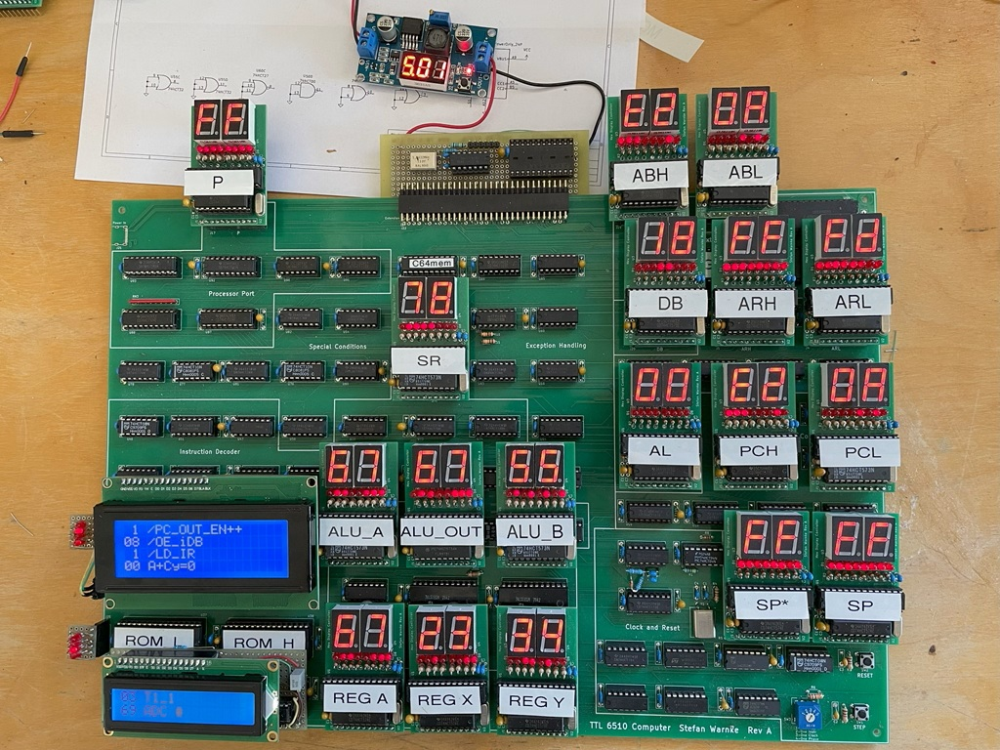

<h1 style="text-align: center;">TL 6510 Computer</h1>
<h2 style="text-align: center;">Yet another CPU made from TTL chips</h2>
 

  

 
<h3 style="text-align: center;">Introduction</h3>
I know, this is not the first TTL CPU/Computer and not the last. But I got interested in designing my own TTL-CPU after a friend showed me his <a href="https://eater.net/8bit/">"Ben Eater 8bit Computer"</a> setup. I really liked the educational part of it, even that the CPU is very limited. I then looked into the <a href="https://gigatron.io/">"Gigatron - TTL microcomputer"</a>, which is a clever RISC-like design.  
Both CPU designs had not been modeled after any existing CPU architecture. Because of its nature, the Gigatron doesn't even require any micro code. It runs fast, but it also doesn't support any register display. Ben Eater's design supports binary and hex-displays, but is very limited and slow.  
For my own design I wanted to imitate a real existing CPU, allowing for extensive debug and display options as well as running it as fast as the original. A simple and very common CPU of the past was the <a href="https://en.wikipedia.org/wiki/MOS_Technology_6502">MOS 6502</a> with its variant 6510 running in the <a href="https://en.wikipedia.org/wiki/Commodore_64">Commodore C64</a>. Even though I liked <a href="https://en.wikipedia.org/wiki/Zilog">Zilog</a>, the complexity of the <a href="https://en.wikipedia.org/wiki/Zilog_Z80">Z80 CPU </a>was much higher and harder to bring on a board like this. However, here is a project that implements both: <a href="https://hackaday.io/project/190345-isetta-ttl-computer">Isetta TTL computer</a> 
To allow for extensive register displays, I added headers where smaller boards can be plugged in for single steps. They can be removed for full speed. A special logic also allows single instruction steps, single clock phase steps. For the last mode I found it better to replace the 8-bit hex display boards for the instruction register and the micro codes with special LCD module controllers displaying text lines in addition to the codes. 
I tried to stick to <a href="https://en.wikipedia.org/wiki/List_of_7400-series_integrated_circuits#Larger_footprints">74xx logic chips</a>, mainly the HCT series. But I had to do some exceptions. I wanted to use real <a href="https://en.wikipedia.org/wiki/74181">ALU chips</a> (because I always wanted to do something with these) and had to settle to the 74LS181, which is still available. I also had to use 2 <a href="https://en.wikipedia.org/wiki/Generic_Array_Logic">GALs</a>, one for the C64-like chip select decoder for memories and IOs (part of a PAL in the C64). I had to introduce the second GAL for remapping the ALU codes because I ran out of micro code bits. Now it maps 4-bit codes plus CY to 5 ALU selection bits plus carry-in. I had to resist the temptation to replace more logic with GALs. The extreme would have been implementing the whole board into an <a href="https://en.wikipedia.org/wiki/Field-programmable_gate_array">FPGA</a>, which was not the goal :-). 
Before I even got started designing my own CPU, I spent quite some time on creating a simulation tool <a href="https://github.com/StefansAI/SimTTL">SimTTL</a> to analyze both designs above and then working on this design.  In addition, I had to create the <a href="https://github.com/StefansAI/MicroCodeGenerator">MicroCodeGenerator</a> for this design and the small boards <a href="https://github.com/StefansAI/HexDisplayController">HexDisplayController</a>, <a href="https://github.com/StefansAI/LCD-DisplayController">LCD-DisplayController</a> and <a href="https://github.com/StefansAI/ArduinoExpander">ArduinoExpander</a> (for testing bread board cicuits). All of this came together in this project. 

<h3 style="text-align: center;">Description</h3>
<h4 style="text-align: center;">Page 2: Clock and Reset</h4>
 

  

 

I made the first board revision and had to realize that I should have finished simulating all instructions and micro code conditions completely. Now I'm pretty much done with all simulations and changing the schematic. I'm working on the new layout for Rev B. 
I'm also still working on the documentation of the design.

