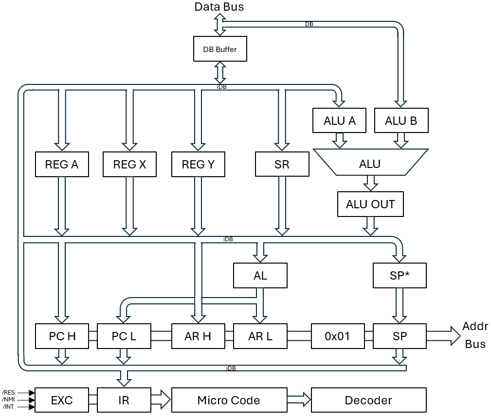
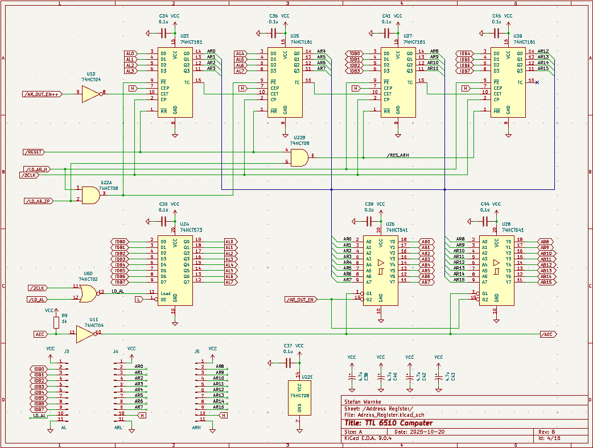

<h1 style="text-align: center;">TL 6510 Computer</h1>
<h2 style="text-align: center;">Yet another CPU made from TTL chips</h2>
 

  

 
<h3 style="text-align: center;">Introduction</h3>
I know, this is not the first TTL CPU/Computer and not the last. But I got interested in designing my own TTL-CPU after a friend showed me his <a href="https://eater.net/8bit/">"Ben Eater 8bit Computer"</a> setup. I really liked the educational part of it, even that the CPU is very limited. I then looked into the <a href="https://gigatron.io/">"Gigatron - TTL microcomputer"</a>, which is a clever RISC-like design.  
Both CPU designs had not been modeled after any existing CPU architecture. Because of its nature, the Gigatron doesn't even require any micro code. It runs fast, but it also doesn't support any register display. Ben Eater's design supports binary and hex-displays, but is very limited and slow.  
For my own design I wanted to imitate a real existing CPU, allowing for extensive debug and display options as well as running it as fast as the original. A simple and very common CPU of the past was the <a href="https://en.wikipedia.org/wiki/MOS_Technology_6502">MOS 6502</a> with its variant 6510 running in the <a href="https://en.wikipedia.org/wiki/Commodore_64">Commodore C64</a>. Even though I liked <a href="https://en.wikipedia.org/wiki/Zilog">Zilog</a>, the complexity of the <a href="https://en.wikipedia.org/wiki/Zilog_Z80">Z80 CPU </a>was much higher and harder to bring on a board like this. However, here is a project that implements both: <a href="https://hackaday.io/project/190345-isetta-ttl-computer">Isetta TTL computer</a> 
To allow for extensive register displays, I added headers where smaller boards can be plugged in for single steps. They can be removed for full speed. A special logic also allows single instruction steps, single clock phase steps. For the last mode I found it better to replace the 8-bit hex display boards for the instruction register and the micro codes with special LCD module controllers displaying text lines in addition to the codes. 
I tried to stick to <a href="https://en.wikipedia.org/wiki/List_of_7400-series_integrated_circuits#Larger_footprints">74xx logic chips</a>, mainly the HCT series. But I had to do some exceptions. I wanted to use real <a href="https://en.wikipedia.org/wiki/74181">ALU chips</a> (because I always wanted to do something with these) and had to settle to the 74LS181, which is still available. I also had to use two <a href="https://en.wikipedia.org/wiki/Generic_Array_Logic">GALs</a>, one for the C64-like chip select decoder for memories and IOs (part of a PAL in the C64). I had to introduce the second GAL for remapping the ALU codes because I ran out of micro code bits. Now it maps 4-bit codes plus CY to 5 ALU selection bits plus carry-in. I had to resist the temptation to replace more logic with GALs. The extreme would have been implementing the whole board into an <a href="https://en.wikipedia.org/wiki/Field-programmable_gate_array">FPGA</a>, which was not the goal :-). 
The goal was to create a design that comes as close to the processor functionality as possible, including timing. Since the hardware is not exactly the same, the micro code execution does not match 100%. But the general execution comes close and all instructions take the same number of clocks as the original. In very few cases dummy micro steps had to be included to meet the target. The only exceptions, where the original timing could not be met, are the ADC and SBC instructions in BCD mode. As far as I could find out, these are seldomly used, so this mode was implemented with more micro steps instead of more hardware. 
There is a great chip simulator <a href="http://www.visual6502.org/JSSim/expert.html">here</a>.
 
Before I even got started designing my own CPU, I spent quite some time on creating a simulation tool <a href="https://github.com/StefansAI/SimTTL">SimTTL</a> to analyze both designs above and then working on this design.  In addition, I had to create the <a href="https://github.com/StefansAI/MicroCodeGenerator">MicroCodeGenerator</a> for this design and the small boards <a href="https://github.com/StefansAI/HexDisplayController">HexDisplayController</a>, <a href="https://github.com/StefansAI/LCD-DisplayController">LCD-DisplayController</a> and <a href="https://github.com/StefansAI/ArduinoExpander">ArduinoExpander</a> (for testing bread board circuits). All of this came together in this project. 
If you want to know more about the 6502 processor, there is a lot out there. I personally liked <a href="http://www.6502.org/">6502.org</a> and <a href="https://www.masswerk.at/6502/">masswerk</a> and many more. 

<h3 style="text-align: center;">Description</h3>
<h4 style="text-align: center;">Overview</h4>
 

  

 
Here is a very simplified block diagram. The external data bus is connected with the internal data bus through a bi-directional buffer. There are the three 8-bit registers A, X, and Y with inputs and outputs connected to the internal data bus. There is the status register and the ALU with it's two input registers and an output buffer to place the results on the internal data bus. While the A input register of the ALU is connected to iDB, it turned out to be beneficial to connect the B input register to the external data bus. This allowed loading ALU_A and ALU_B in the same clock phase.  
In the lower half of the block diagram are the three 16-bit address registers PC, AR, and SP and their connections to the internal data bus and external address bus. All three address registers are split into two 8-bit registers that can be loaded and read individually, except AR and the high part of the SP. In order to load a new address while the address has to be stable at the external address bus, there are registers to buffer the low part until the high part can be loaded together with the low part. 
At the bottom of the block diagram is just a hint to the exception handler, instruction register, micro code memory and the instruction decoder providing the signals for controlling all functionality. There is much more detail in the schematics.
 
 
<h4 style="text-align: center;">Page 2: Clock and Reset</h4>
 

  

 
While there is nothing special about the reset part, there is a bit more than just a clock generator. First, there are 2 clock sources to chose from. The crystal one for normal speed and the 555 timer for slow speeds down to seconds. The last one makes it fun to watch clock by clock execution with all displays. 
The crystal is four times the CPU clock of 1MHz in the C64. The board might run much faster, but that will have to be tested out. There are 2 JK-flip-flops to divide the crystal clock by 2 and 4. The last one is sampled and goes out as PHI2 as in the origional 6502 processor system. 
Everything else is for creating single step modes for instructions or clock phases. Since the whole TTL processor is completely static, its clock can be paused indefinitely. This fact is used to implement single instruction steps or single clock phase steps. Let's check with <a href="https://github.com/StefansAI/SimTTL">SimTTL</a>.
 
 

  

 
The screenshot above is the standard mode of operation. The signals 4CLK2* and 4CLK4* are changing with the falling edge of 4CLK dividing it by 2 and 4. The signals 2CLK, iPHI2 and PHI2 sample those at the rising edge of 4CLK and the system runs freely.
 
 

  

 
When the rotary switch is in the second position ("Step one Instruction") iPHI2 will be held constant with the next activation of /LD_IR until the STEP button is pressed as here simulated by injecting a low pulse of the signal /STEP_BTN, which in return allows sampling the divided clocks again. The circuitry keeps a strong phase relationship with the external PHI2 clock, so it always keeps stays synchronized.
 
 

  

 
Switching to the third position ("Step on Clock Phase") halts the internal clock iPHI2 after each transition, while 2CLCK changes twice each time and is also held constant until the next step button is pressed. This function allows stepping through each micro code phase.
 
 

  

 
The same clock control is also used for the RDY function implementation. In the 6502, the RDY signal is sampled with the rising edge of the clock PHI2. As long as RDY is sampled as low, the processor has to wait for the external memory or IO port. The internal clock is held constant again as in the other cases.
<h4 style="text-align: center;">Page 3: Program Counter</h4>
 

  

 
The 16-bit program counter is realized with 4 chips of the 4-bit counters 74HCT161. The two 8-bit groups can be loaded individually. As described in the overview, the lower 8-bit are loaded from the AL bus. These signals are coming from the Address Low (AL) register, which is contained on page 4 and will be explained there. The higher 8-bit counters are loaded from the internal data bus (iDB) directly. There are two 8-bit output buffers to the external address bus and two other ones to place the counter contents onto the internal data bus. The last ones allow reading the PC parts. 
Several control signals are used to increment the PC, to load it and to activate the bus drivers. These signals are mostly generated in the instruction decoder on page 8. 
Something that can be found in several parts of the schematics are female headers, mostly with 11 pins to plug in the <a href="https://github.com/StefansAI/HexDisplayController">HexDisplayController</a> or <a href="https://github.com/StefansAI/LCD-DisplayController">LCD-DisplayController</a>.  
 

  

 
The <a href="https://github.com/StefansAI/SimTTL">SimTTL</a> screen shot above shows the JSR and RTS instructions, which exercise incrementing, saving and loading of PC contents. The rising edge of /LD_IR captures the iDB contents into IR (red trigger marker, yellow marker and light blue marker). In each cases, the PC is incremented with the rising edge of /2CLK (falling edge of 2CLK). The JSR instruction is loaded from 0xFE41, then the low part of the JSR address from 0xFE42 (first blue marker) and the high part from 0xFE43 (second blue marker). The two parts of the PC are then written to the stack (next 2 blue marker, where R/W is low). The following blue marker is placed at the rising edge of /LD_PC_H, which loads AL and iDB into the PC to output the new execution address (0xFE01). The RTS instruction is then loaded from there (yellow marker). While the address bus continues to put out the PC of 0xFE02 for internal phases until the return address is read from the stack at the next 2 blue markers and loaded to AL and then to PCH and PCL simultanously. The return address is then incremented in the next phase before the execution can be continued fetching the next instruction from 0xFE44, the instruction after the JSR 0xFE01 instruction.
 
 

  
  

 
Let's have a look at the <a href="https://github.com/StefansAI/MicroCodeGenerator">MicroCodeGenerator</a> application, where the sequences for all instructions are defined. Here are the screen shots for the two instructions JSR and RTS. It can be cross-referenced with the SimTTL screen shots. MC corresponds to T0, T1, T2,... and iPHI2 to the phase Tn_0 or Tn_1.
 
<h4 style="text-align: center;">Page 4: Address Register</h4>
 

  

 
The address register page looks similar to the program counter page. But there are no buffers to put the register parts on the internal data bus and there is the AL register instead. The AL register was already utilized in the program counter part above. In contrast to the mostly used edge-triggered 74x574 chips, the AR is based on the transparent latch chip 74x573. This way, a register behind the AL register can be loaded from iDB through the AL.
 
 

  

 
Here is an example, where AR is used. RESET, NMI, INT and the BRK instruction have to read the address from the vector table. The instruction starts again with fetching the instruction at the red marker. After saving the PC and SR (status register) onto the stack, AL and ARH are loaded with the table address 0xFFFE before the first blue marker. Then AR is placed onto the address bus and AL reloaded with the low part of the interrupt service routine (ISR) address. AR is then incremented and the high part is loaded together with AL into the PC. The first instruction of the ISR is then fetched at the yellow marker.
 
 

  

 
Here is the BRK instruction definition in <a href="https://github.com/StefansAI/MicroCodeGenerator">MicroCodeGenerator</a>.
 
 
<h4 style="text-align: center;">Page 5: Stack Pointer</h4>
 

  

 
The stack pointer is only 8-bit wide in the 6502 with a fixed high address part of 0x01. Even though the SP could have implemented using counters similar to the PC and AR (but up/down counters 74HCT193 instead). However, the 6502 uses the ALU to increment or decrement the SP and that's why SP is just a register. To save a buffer, two registers are used to be loaded in parallel. One of them is connected to the internal data bus and the other is connected to lower address bus. 
Similar to AL, there is an additional transparent register in front of the SP register. This way a new SP value can be captured while the stack address is still on the bus.
 
 

  

 
Here is an execution example of the instructions PHA (Push A to stack) and PLA (Pull A from stack). The PHA instruction is fetched at the red marker. Then /OE_SP is activated and 0xFF from SP is placed on iDB to be loaded into ALU_A (first blue marker). At the same time /SP_OUT_EN is activated and 0x01FF appears on the address bus to begin writing. 
Back to the ALU: ALU_S is 0xF, which means "A minus 1 plus Cin" (<a href="https://www.righto.com/2017/03/inside-vintage-74181-alu-chip-how-it.html">Interactive 74181 viewer</a>). In this case 0xFF-1=0xFE appears at the ALU output, which is loaded into SP* from iDB (/OE_ALU=L, /LD_SP*). 
Between second and third blue marker, the write cycle is finalized by placing the contents of register A on the external data bus and activating the write signal (R/W=L). At the same time /LD_SP is actiavted to load SP with the contents from SP*, which is the decremented stack pointer value for any next stack operaation. 
The reverse is now happening at the PLA instruction between the yellow marker and the lightblue marker. Again, first the contents of SP is loaded into ALU_A, but ALU_S=0x0 and ALU_CIN=0, which means "A plus Cin" (Cin is inverted at the ALU). The result is now 0xFE+1=0xFF, which is loaded into SP*. In the next phase, SP is loaded from SP* and put out on the address bus for reading from the stack.  The previously written register A value of 0xA5 appears on the external data bus and then on iDB. It is not loaded into A immediately, but into ALU_A instead. The reason is, that PLA like other load instructions set the N and the Z flag according to the loaded value. This is done when going through the ALU and with ALU_S=0 and ALU_CIN=1, which means ALU=ALU_A. /OE_ALU and /LD_A are both activated in the next phase while the next instruction fetch is started. 
 
 

  
  

 
Here are the micro code definition for the two instructions shown above, PHA and PLA. It can be followed, what signals are activated when.

     
 
<h4 style="text-align: center;">Status</h4>
 
I made the first board revision and had to realize that I should have finished simulating all instructions and micro code conditions completely. Now I'm pretty much done with all simulations and changing the schematic. I'm working on the new layout for Rev B. 
I'm also still working on the documentation of the design.

