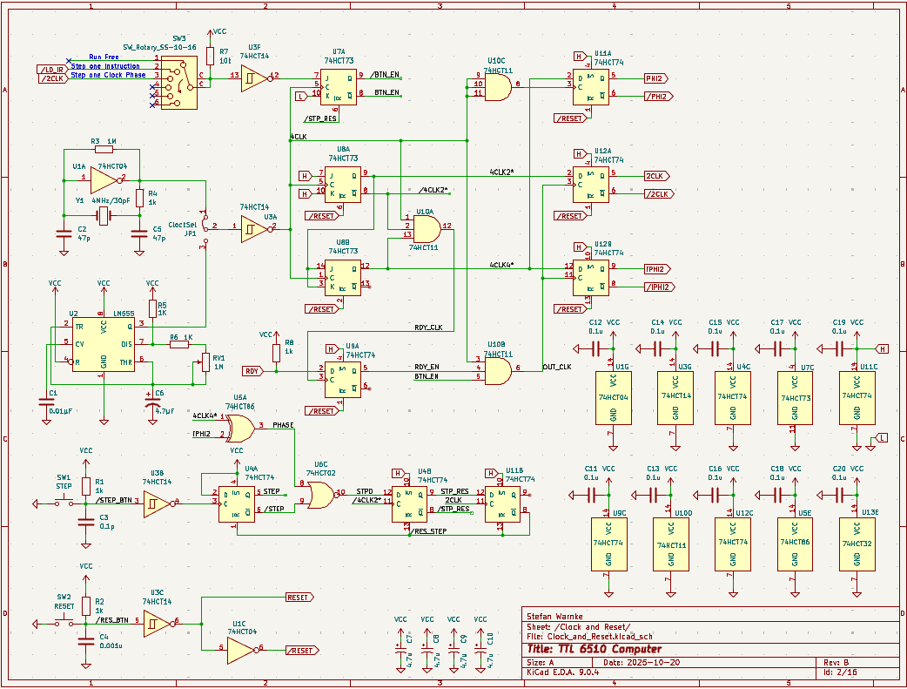
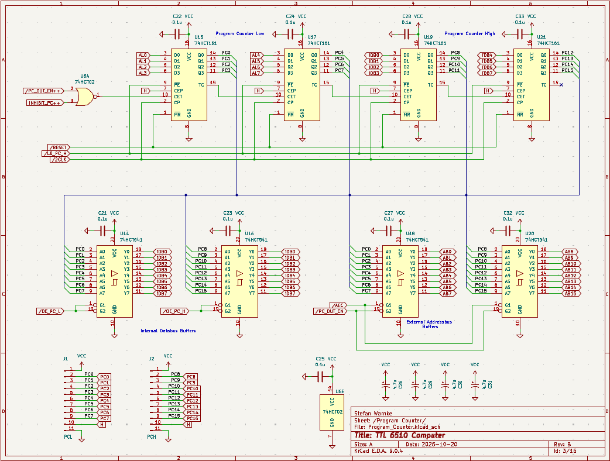
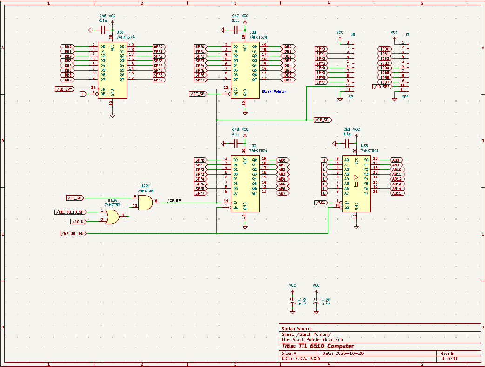

<h1 style="text-align: center;">TL 6510 Computer</h1>
<h2 style="text-align: center;">A CPU made from TTL chips for education and running C64 Basic/Kernel</h2>
 

  

 
<h3 style="text-align: center;">Introduction</h3>
I know, this is not the first TTL CPU/Computer and not the last. But I got interested in designing my own TTL-CPU after a friend showed me his <a href="https://eater.net/8bit/">"Ben Eater 8bit Computer"</a> setup. I really liked the educational part of it, even though the CPU is very limited. I then looked into the <a href="https://gigatron.io/">"Gigatron - TTL microcomputer"</a>, which is a clever RISC-like design.  
Both CPU designs had not been modeled after any existing CPU architecture. Because of its nature, the Gigatron doesn't even require any micro code. It runs fast, but it also doesn't support any register display. Ben Eater's design supports binary and hex-displays, but is very limited and slow.  
For my own design I wanted to imitate a real existing CPU, allowing for extensive debug and display options as well as running it as fast as the original. A simple and very common CPU of the past was the <a href="https://en.wikipedia.org/wiki/MOS_Technology_6502">MOS 6502</a> with its variant 6510 running in the <a href="https://en.wikipedia.org/wiki/Commodore_64">Commodore C64</a>. Even though I liked <a href="https://en.wikipedia.org/wiki/Zilog">Zilog</a>, the complexity of the <a href="https://en.wikipedia.org/wiki/Zilog_Z80">Z80 CPU </a>was much higher and harder to bring on a board like this. However, here is a project that implements both if of interest: <a href="https://hackaday.io/project/190345-isetta-ttl-computer">Isetta TTL computer</a> 
To allow for extensive register displays, I added headers where smaller boards can be plugged in for single step updates. They can be removed for full speed. A special logic also allows single instruction steps, single clock phase steps. For the last mode I found it better to replace the 8-bit hex display boards for the instruction register and the micro codes with special LCD module controllers displaying text lines in addition to the codes. 
I tried to stick to <a href="https://en.wikipedia.org/wiki/List_of_7400-series_integrated_circuits#Larger_footprints">74xx logic chips</a>, mainly the HCT series. But I had to do some exceptions. I wanted to use real <a href="https://en.wikipedia.org/wiki/74181">ALU chips</a> (because I always wanted to do something with these) and had to settle to the 74LS181, which is still available. I also had to use two <a href="https://en.wikipedia.org/wiki/Generic_Array_Logic">GALs</a>, one for the C64-like chip select decoder for memories and IOs (part of a PAL in the C64). And I had to introduce the second GAL for remapping the ALU codes because I ran out of micro code bits. Now it maps 4-bit codes plus CY to 5 ALU selection bits plus carry-in. I had to resist the temptation to replace more logic with GALs. The extreme would have been implementing the whole board into an <a href="https://en.wikipedia.org/wiki/Field-programmable_gate_array">FPGA</a>, which was not the goal :-). 
The goal was to create a design that comes as close to the internal processor functionality as possible, including timing. Since the hardware is not exactly the same, the micro code execution does not match 100%. But the general execution comes close and all instructions take the same number of clocks as the original. In very few cases dummy micro steps had to be included to meet the target. The only exceptions, where the original timing could not be met, are the ADC and SBC instructions in BCD mode. As far as I could find out, these are seldomly used, so this mode was implemented with more micro steps instead of more hardware. 
There is a great chip simulator <a href="http://www.visual6502.org/JSSim/expert.html">here</a>.
 
Before I even got started designing my own CPU, I spent quite some time on creating a simulation tool <a href="https://github.com/StefansAI/SimTTL">SimTTL</a> to analyze both designs above and then working on this design.  In addition, I had to create the <a href="https://github.com/StefansAI/MicroCodeGenerator">MicroCodeGenerator</a> for this design and the small boards <a href="https://github.com/StefansAI/HexDisplayController">HexDisplayController</a>, <a href="https://github.com/StefansAI/LCD-DisplayController">LCD-DisplayController</a> and <a href="https://github.com/StefansAI/ArduinoExpander">ArduinoExpander</a> (for testing bread board circuits). All of this came together in this project. 
If you want to know more about the 6502 processor, there is a lot out there. I personally liked <a href="http://www.6502.org/">6502.org</a> and <a href="https://www.masswerk.at/6502/">masswerk</a> and many more. 
One more info: I used this <a href="https://www.amazon.com/dp/B0BFWKS53B">programmer</a> for GALs and Flashs. 
<h3 style="text-align: center;">Description</h3>
<h4 style="text-align: center;">Overview</h4>
 

  

 
Here is a very simplified block diagram. The external data bus is connected with the internal data bus through a bi-directional buffer. There are the three 8-bit registers A, X, and Y with inputs and outputs connected to the internal data bus. There is the status register and the ALU with it's two input registers and an output buffer to place the results on the internal data bus. While the ALU_A input register is connected to iDB, it turned out to be beneficial to connect the B input register to the external data bus. This allowed loading ALU_A and ALU_B in the same clock phase.  
In the lower half of the block diagram are the three 16-bit address registers PC, AR, and SP and their connections to the internal data bus and external address bus. All three address registers are split into two 8-bit registers that can be loaded and read individually, except AR and the high part of the SP. In order to load a new address while the address has to be stable at the external address bus, there are registers to buffer the low part until the high part can be loaded together with the low part. 
At the bottom of the block diagram is just a hint to the exception handler, instruction register, micro code memory and the instruction decoder providing the signals for controlling all functionality. There is much more detail in the schematics.
 
 
<h4 style="text-align: center;">Page 2: Clock and Reset</h4>
 

  

 
While there is nothing special about the reset part, there is a bit more than just a clock generator. First, there are 2 clock sources to chose from. The crystal one for normal speed and the 555 timer for slow speeds down to seconds. The last one makes it fun to watch clock by clock execution with all displays. 
The crystal is four times the CPU clock of 1MHz in the C64. The board might run much faster, but that will have to be tested out. There are 2 JK-flip-flops to divide the crystal clock by 2 and 4. The last one is sampled and goes out as PHI2 as in the original 6502 processor system. 
Everything else is for creating single step modes for instructions or clock phases. Since the whole TTL processor is completely static, its clock can be paused indefinitely. This fact is used to implement single instruction steps or single clock phase steps. Let's check with <a href="https://github.com/StefansAI/SimTTL">SimTTL</a>.
 
 

  

 
The screenshot above is the standard mode of operation. The signals 4CLK2* and 4CLK4* are changing with the falling edge of 4CLK dividing it by 2 and 4. The signals 2CLK, iPHI2 and PHI2 sample those at the rising edge of 4CLK and the system runs freely.
 
 

  

 
When the rotary switch is in the second position ("Step one Instruction") iPHI2 will be held constant with the next activation of /LD_IR until the STEP button is pressed as here simulated by injecting a low pulse of the signal /STEP_BTN, which in return allows sampling the divided clocks again. The circuitry keeps a strong phase relationship with the external PHI2 clock, so it always stays synchronized.
 
 

  

 
Switching to the third position ("Step on Clock Phase") halts the internal clock iPHI2 after each transition, while 2CLCK changes twice each time and is also held constant until the next step button is pressed. This function allows stepping through each micro code phase.
 
 

  

 
The same clock control is also used for the RDY function implementation. In the 6502, the RDY signal is sampled with the rising edge of the clock PHI2. As long as RDY is sampled as low, the processor has to wait for the external memory or IO port. The internal clock is held constant again as in the other cases.
<h4 style="text-align: center;">Page 3: Program Counter</h4>
 

  

 
The 16-bit program counter is realized with 4 chips of the 4-bit counters 74HCT161. The two 8-bit groups can be loaded individually. As described in the overview, the lower 8-bit are loaded from the AL bus. These signals are coming from the Address Low (AL) register, which is contained on page 4 and will be explained there. The higher 8-bit counters are loaded from the internal data bus (iDB) directly. There are two 8-bit output buffers to the external address bus and two other ones to place the counter contents onto the internal data bus. The last ones allow reading the PC parts. 
Several control signals are used to increment the PC, to load it and to activate the bus drivers. These signals are mostly generated in the instruction decoder on page 8. 
Something that can be found in several parts of the schematics are female headers, mostly with 11 pins to plug in the <a href="https://github.com/StefansAI/HexDisplayController">HexDisplayController</a> or <a href="https://github.com/StefansAI/LCD-DisplayController">LCD-DisplayController</a> in two special cases.  
 

  

 
The <a href="https://github.com/StefansAI/SimTTL">SimTTL</a> screenshot above shows the JSR and RTS instructions, which exercise incrementing, saving and loading of PC contents. The rising edge of /LD_IR captures the iDB contents into IR (red trigger marker, yellow marker and light blue marker). In each of these cases, the PC is incremented with the rising edge of /2CLK (falling edge of 2CLK). The JSR instruction is loaded from 0xFE41, then the low part of the JSR address from 0xFE42 (first blue marker) and the high part from 0xFE43 (second blue marker). The two parts of the PC are then written to the stack (next 2 blue marker, where R/W is low). The following blue marker is placed at the rising edge of /LD_PC_H, which loads AL and iDB into the PC to output the new execution address (0xFE01). The RTS instruction is then loaded from there (yellow marker). While the address bus continues to put out the PC of 0xFE02 for internal phases until the return address is read from the stack at the next 2 blue markers and loaded to AL and then to PCH and PCL simultanously. The return address is then incremented in the next phase before the execution can be continued fetching the next instruction from 0xFE44, the instruction after the JSR 0xFE01 instruction.
 
 

  

  

 
Let's have a look at the <a href="https://github.com/StefansAI/MicroCodeGenerator">MicroCodeGenerator</a> application, where the sequences for all instructions are defined. Here are the screenshots for the two instructions JSR and RTS. It can be cross-referenced with the SimTTL screenshots. MC corresponds to T0, T1, T2,... and iPHI2 to the phase Tn_0 or Tn_1.
 
<h4 style="text-align: center;">Page 4: Address Register</h4>
 

  

 
The address register page looks similar to the program counter page. But there are no buffers to put the register parts on the internal data bus and there is the AL register instead. The AL register was already utilized in the program counter part above. In contrast to the mostly used edge-triggered 74x574 chips, the AR is based on the transparent latch chip 74x573. This way, a register behind the AL register can be loaded from iDB through the AL.
 
 

  

 
Here is an example, where AR is used. RESET, NMI, INT and the BRK instruction have to read the address from the vector table. The instruction starts again with fetching the instruction at the red marker. After saving the PC and SR (status register) onto the stack, AL and ARH are loaded with the table address 0xFFFE before the first blue marker. Then AR is placed onto the address bus and AL reloaded with the low part of the interrupt service routine (ISR) address. AR is then incremented and the high part is loaded together with AL into the PC. The first instruction of the ISR is then fetched at the yellow marker.
 
 

  

 
Here is the BRK instruction definition in <a href="https://github.com/StefansAI/MicroCodeGenerator">MicroCodeGenerator</a>.
 
 
<h4 style="text-align: center;">Page 5: Stack Pointer</h4>
 

  

 
The stack pointer is only 8-bit wide in the 6502 with a fixed high address part of 0x01. The SP could have been implemented using counters similar to the PC and AR (but up/down counters 74HCT193 instead). However, the 6502 uses the ALU to increment or decrement the SP and that's why SP is just a register. To save a buffer, two registers are used to be loaded in parallel. One of them is connected to the internal data bus and the other is connected to lower address bus. 
Similar to AL, there is an additional transparent register in front of the SP register. This way a new SP value can be captured while the stack address is still on the bus.
 
 

  

 
Here is an execution example of the instructions PHA (Push A to stack) and PLA (Pull A from stack). The PHA instruction is fetched at the red marker. Then /OE_SP is activated and 0xFF from SP is placed on iDB to be loaded into ALU_A (first blue marker). At the same time /SP_OUT_EN is activated and 0x01FF appears on the address bus to begin writing. 
Back to the ALU: ALU_S is 0xF, which means "A minus 1 plus Cin" with Cin inverted (<a href="https://www.righto.com/2017/03/inside-vintage-74181-alu-chip-how-it.html">Interactive 74181 viewer</a>, where you can change all inputs via mouse click). In this case 0xFF-1=0xFE appears at the ALU output, which is loaded into SP* from iDB (/OE_ALU=L, /LD_SP*). 
Between second and third blue marker, the write cycle is finalized by placing the contents of register A on the external data bus and activating the write signal (R/W=L). At the same time /LD_SP is actiavted to load SP with the contents from SP*, which is the decremented stack pointer value for any next stack operation. 
The reverse is now happening at the PLA instruction between the yellow marker and the lightblue marker. Again, first the contents of SP is loaded into ALU_A, with ALU_S=0x0 and ALU_CIN=0, which means "A plus Cin" (Cin is inverted at the ALU). The result is now 0xFE+1=0xFF, which is loaded into SP*. In the next phase, SP is loaded from SP* and put out on the address bus for reading from the stack.  The previously written register A value of 0xA5 appears on the external data bus and then on iDB. It is not loaded into A immediately, but into ALU_A instead. The reason is, that PLA like other load instructions set the N and the Z flag according to the loaded value. The flags are set when going through the ALU. WIth ALU_S=0 and ALU_CIN=1, ALU_A is passed to the output (ALU=ALU_A). /OE_ALU and /LD_A are both activated in the next phase while the next instruction fetch is started. 
 
 

  

  

 
Here are the micro code definitions for the two instructions shown above, PHA and PLA. It can be followed, what signals are activated when.
 
 
<h4 style="text-align: center;">Page 6: Registers and DB driver</h4>
 

  

 
Page 6 contains the registers A, X and Y as well as the data bus driver between external and internal data bus. Again, the headers for the <a href="https://github.com/StefansAI/HexDisplayController">HexDisplayControllers</a> are added here. It looks straight forward. 
Just as a side note, the last page of the schematics has shadow registers just for SimTTL. They are loaded in parallel to the real registers here, but their outputs are always active to show the contents in simTTL. These shadow registers don't appear in the BOM nor do they exist on the board. They show up in SimTTL as REG_A, REG_X and REG_Y (see below)
 
 

  

 
Here is the code for this example:

<pre>
FE02  A9 A5                      LDA #$A5
FE04  AA                         TAX
FE05  A0 00                      LDY #$00
FE07  98                         TYA
FE08  A0 33                      LDY #$33
FE0A  85 10                      STA $10
</pre>

The first instruction (LDA #$A5) starts at the red marker. As in the PLA example above, the immediate value of $A5 is read from memory, placed onto the internal data bus when /OE_iDB=L and loaded into ALU_A at /LD_ALU_A=L. In the next phase /OE_ALU is activated and then loaded into A. At the same moment the NZ and ZF flags are changed. In this case NF is set and ZF is reset. 
The next instruction TAX activates /OE_A and again the data is loaded into ALU_A again and then into X via /LD_X. 
In result of LDY #$00, the zero flag (ZF) is set and the negativae flag (NF) is reset. With the next LDY #$33, resets ZF, since the value is not zero. 
The last instruction is STA $10, storing A to the zero page location 0x0010. This address is put out onto the address bus, then /OUT_DIR and /OE_A are activated and then R/W to write the contents to the external memory.
 
 

  

  

  

  

 
Above are the screenshots of all instructions used above as reference.
 
 
<h4 style="text-align: center;">Page 7: Micro Code Sequencer</h4>
 

  

 
There are 2 ROMs in parallel to produce 16 bit wide micro codes. An instruction register provides 8 bit of the address. But the micro steps are created by a 4-bit counter and a clock phase. This together allow for 5-bit for the micro steps, giving 16 clocks or 32 phases for each instruction. The 6502 would normally only use up to 7 clocks per instruction. But since I decided to implement BCD calculations with more micro steps instead of more hardware, I gave one more bit to the micro steps. 
If you look closer, the instruction and the micro steps generate 13 bits of the address bus. That leaves 4 bits for additional conditions. The highest bit is reserved for exceptions, like interrupts and reset, because they will get the highest priority. Then there are 3 bits split into any special condition, then full carry and half carry which also can have double meaning. Those bits are generated for address calculations, branch conditions or BCD handling. 
The 16-bit outputs are then grouped into the following: 
- Address output 
- Internal databus enable 
- Load internal register 
- ALU-code 
Originally there were just 2 identical registers to capture the ROM outputs. But when I ran out out bits, I decided to replace one register with a GAL. This GAL not only acts as a register, it also expands the 4-bit ALU codes plus CF from the ROM into 5-bit ALU function bits plus CIN. This is possible since the ALU chips have more functions than actually needed for the 6510 computer. 
The GAL projects are made with <a href="https://www.microchip.com/en-us/development-tool/WinCUPL">WinCupl</a> and the source codes are part of the project in <a href="https://github.com/StefansAI/TTL-6510-Computer/tree/main/WinCupl/ALUDECODER">GitHub.</a> 
I used this <a href="https://www.amazon.com/dp/B0BFWKS53B">programmer</a> to program the GALs as well as the Flash chips.
 
 

  

 
In <a href="https://github.com/StefansAI/SimTTL">SimTTL</a> the execution of the JMP instruction looks like this. The Micro Code counter (MC) is the input into the ROMs. But there is a latency of one phase, I added "REG_MC" to sample MC with the same latency. "REG_MC" directly corresponds now to T1,T2,T3 etc. There is a low pulse of /LD_IR at the end of the "LSR A" loading the instruction register (IR) with "0x4C" and incrementing PC, thus starting the execution of the "JMP abs" instruction.   
At the end of T1 "/LD_AL" loads 0x7C from the internal databus (iDB) into the AL register. AL is a transparent D-Latch and that's why the output changes shortly after activating the load signal. At T2_1, the signal "/LD_PC_H" is activated and 0xFE is loaded from iDB into PC_H with the rising edge. At the same edge PC_L is loaded from AL, so PC is now 0xFE7C. T3_1 now loads the next instruction (EOR abs).
 
 

  

 
Again, here is the micro code for JMP and EOR.
 
 
<h4 style="text-align: center;">Page 8: Instruction Decoder</h4>
 

  

 
The instruction decoder is simply passing the bit groups to cascaded decoder chips. But in addition, signal combinations are often needed in all groups and a couple of AND-gates become low-active if one of the inputs are low-active. The blue texts at decoder outputs correspond to the selector name in <a href="https://github.com/StefansAI/MicroCodeGenerator">MicroCodeGenerator</a>. The final signal label appears right to it or the additional gates. 
The first decoder is responsible for the address bus selection. One input to enable the decoder is /AEC. Another bus user (i.e. VIC) can steal the low phase of PHI2 to use the bus while the high phase is still available for the CPU. 
The next group creates the load signals. Here the low phase of /2CLK enables the decoders to create better defined timing. There are still delays through the AND-gates. The very first output is left blank to allow for a no-load-code. 
It's beneficial (and common) to load the ALU_A register directly from the ALU output again for next operations. To implement this, the signal /OE_ALU again combined with /2CLK feeds into the final signal /LD_ALU_A. But it can be prohibited via DEC_COND (decimal coondition) for BCD corrections. 
The largest group is the output enable signal group with 5-bit. But instead of the possible 32 decoded outputs, only 24 were needed here. Since there was still one code needed to not enable any output at all, the decoders are wired in a way that the 24 outputs start at input code 8, leaving 0..7 as no-output-enable.
 
 

  

 
The SimTTL screenshot shows the execution of two "ADC abs,X" instructions back-to-back (first starting at red marker, second at yellow marker ending at light blue). The second one calculates a data address with a carry from the low part of the address to the high part. According to the 6502 documentation an additional clock is inserted after the low part addition to increment the high part as correction. In the screenshot, the signal FCY_COND is activated to switch the micro code execution to the increment portion. 
Here is the code, including the preparation before ADC.

<pre>
FE1E  A2 66                      LDX #$66
FE20  A0 67                      LDY #$67
FE22  A9 12                      LDA #$12
                                 ; Testing Op Codes
FE24  7D 34 12                   ADC $1234,X
FE27  7D F4 12                   ADC $12F4,X
</pre>

  

 
The MicroCodeGenerator screenshot shows both micro code definitions. The execution starts with FCY_COND=L and switches over, when it transitions to high executing the increment in the ALU and ending a clock later. 
In T1_1 the code for /LD_ALU_AB actually activates /LD_ALU_A and /LD_ALU_B simultanously through the AND-gates. Since /OE_X is active, the contents of register X is loaded into ALU_A, while at the same time the low part of the absolute address ($34 or $F4) is loaded into ALU_B. 
In T2_0 the signal /OE_ALU_FDCY is activated, which results in capturing the CY flag and setting FCY_COND accordingly. Details follow later on page 12.  
It is important to keep in mind that there is always 1 phase latency between the iput of the ROM and the outut sampling. When the FCY_COND signal is changing, it can only assumed to switch over to the other code track one clock phase later.  
 
 
<h4 style="text-align: center;">Page 9: Exception Handling</h4>
 

  

 
This part takes care of handling the exceptions /RESET, /NMI and /INT. These signals interrupt the current execution in different ways.  
<b>Reset:</b> 
Reset has the highest priority, interrupting everything immediately after activation. As long as /RESET is kept low, the whole processor will be held in reset until execution can start with the transition to high. That rising edge forces the exception handling immediately. 
<b>NMI:</b> 
The non-maskable interrupt (NMI) is activated by the falling edge, which is detected in the first FF and the OR-gate to activate the /NMI_BIT. The JK-FF will deactivate /NMI_BIT with the next /LD_IR after the NMI exception code had been executed (/EXC=L, IR1=L, which is the sampled /NMI_BIT). This way an NMI can occur while INT-exception is handled, so that the NMI handling follows immediately. 
<b>INT:</b> 
The maskable interrupt has the lowest priority and has to be held low until handled. This happens with the next falling edge of /LD_IR if the interrupt had been enabled.   
In any of these exception cases the signal /ACT_EXC will be activated and then sampled with /LD_IR to create the signal EXC indicating the exception execution. At the same moment all three exception bits (/RES_BIT, /NMI_BIT and /INT_BIT) will be sampled into an alternative instruction register to replace the main instruction register contents as long as EXC is active. 
To ensure getting back to the original PC for the next instruction after interrupt handling, a special signal INHIBIT_PC++ is generated to disable the increment when /LD_IR is active. 
As described in <a href="https://en.wikipedia.org/wiki/Interrupts_in_65xx_processors">Interrupts in 65xx processors</a> each of these exceptions has to fetch an address from the vector table:
<table class="center">
  <tr>
    <th>Exception</th>
    <th>Vector Low</th>
    <th>Vector High</th>
  </tr>
  <tr>
    <td>INT</td>
    <td>0xFFFE</td>
    <td>0xFFFF</td>
  </tr>
  <tr>
    <td>RESET</td>
    <td>0xFFFC</td>
    <td>0xFFFD</td>
  </tr>
  <tr>
    <td>NMI</td>
    <td>0xFFFA</td>
    <td>0xFFFB</td>
  </tr>
</table>
The hardware has to generate these addresses for the vector table. The pull-up resistor array will take care of any 0xFF on the internal databus. The lowest 4 bits are coming from the micro codes MC_OUT_12..15 latched into the HCT173 when /OE_BRKL is active. These bits are normally repsonsible for the ALU function codes, so the micro codes have to select some ALU selection that creates the correct 4 bits for the vector table address access.
 
 

  

  

 
Here is the reset timing and the micro code from the rising edge of /RESET on (red marker). IR shows the value 0x06, which means /RES_BIT is low and /NMI_BIT and /INT_BIT are high. The disassembler interprets it wrongly as ASL zpg, so ignore it here.  At the first blue marker the low address part for the vector table (0xFC) is read from iDB and loaded into AL. It is followed by reading 0xFF and loading it together with AL into the address register AR. Next, the address 0xFFFC is appearing on the address bus and the value 0x02 is read from the vector table. AR is incremented and 0xFE is now read loaded into PC together with AL. The PC is set to the reset execution address of 0xFE02 in this case.  Before starting there, the stack pointer SP is loaded to 0xFF and the <a href="https://www.nesdev.org/wiki/Status_flags#:~:text=The%20flags%20register%2C%20also%20called%20processor%20status%20or,one%20or%20more%20bits%20and%20leave%20others%20unchanged.">status register</a>
 SR is loaded to 0x06. This sets the Interrupt Disable flag (IF) as the default after reset. To finish up, /ACK_EXC is activated to deactivate /ACT_EXC so that EXC is cleared with /LD_IR.
 
 

  

  

 
The NMI can be triggered by the falling edge of the signal /NMI as shown here with a very short pulse at the red marker. Even though the /INT line was pulled low before /NMI, the next /LD_IR activation goes into the exception handling for the NMI (yellow marker). The IR code is 0x01, meaning /RES_BIT=H and /NMI_BIT=L and /INT_BIT=L, so the micro code for 0x01 and 0x05 (/INT_BIT=H) will have to be identical. Again, ignore the wrong interpretation of the disassembler mnemonic here. 
Together with /LD_IR the signal INHIBIT_PC++ is activated here and as a result the PC is not incremented to keep it as is. In contrast to reset, interrupts have to store the return address and the status register on the stack first, which can be seen after the first 3 blue markers where the stack pointer is on the address bus and the values 0xFE, 0x8D and 0x41 are written. Then a 0xFF is written to SR to disable the interrupt. 
Similar to reset the vector addresses are generated and the address loaded from there. In this case the vector address is 0xFFFA, 0xFFFB and the NMI address to call is 0xFE00 in this case. The EXC signal is cleared again and the execution continues at the NMI service routine.
 
 

  

  

 
The interrupt here is just following the NMI service routine above. The yellow marker shows the RTI instruction before the red marker, where the still pending interrupt is now handled. Again, the return PC address is not incremented, but put onto the stack again together with the status register. It all looks very similar to the NMI handling and the micro code is also almost the same. The difference is in the vector address generated by different ALU codes. Other than that is all identical.
 
 
<h4 style="text-align: center;">Page 10: ALU</h4>
 

  

 
The heart of the ALU are the two 4-bit ALU chips <a href="https://en.wikipedia.org/wiki/74181">74181</a>, which were once widely used in computers of that time. The 74LS181 is still available. There is an <a href="https://www.righto.com/2017/03/inside-vintage-74181-alu-chip-how-it.html">Interactive 74181 viewer</a> where all input bits can be changed via mouse click to see the results.  
The schematics shows the two chips cascaded to 8-bits, the two input registers ALU_A and ALU_B as well as the output buffer connecting back to iDB. 
These ALU chips contain more functions than needed here. But they are also missing few things. First, not a signle shift right function is integrated in the chips, so it had to be implemented externally. It is done simply by adding a secodn ALU_A register with shifted input assignments, so it can be fed into the ALU alternatively. It has to be complemented with an additional FF to include loading D0 into SH_CY and the multiplexer of the ALU_FCY signal to COMB_CY. 
Second, the overflow flag is not generated by these ALY chips and is ralized via the three XOR-gates to create ALU_OV. 
Third, the "A=B" output is not exactly usable as zero flag, so the NAND/AND-gate combination had to be added to create ALU_Z.
 
 

  

  

 
This example demonstrates the use of the ALU in different ways. The instructions "ROR $1234$,X" and "ROR $12F4,X" are executed with X=0x66. The first one does not require an address correction, but the second one does.   
First, the data address has to be calculated by adding the low part of the absolute address and X together. It is loaded to AL and then the address high part is read and both are loaded into AR. In the second ROR-execution the ALU_FCY causes FCY_COND to be set and the high address is loaded to ALU_A to be incremented in the ALU and then loaded to AR as corrected address. 
After reading the data from the memory address (0x65 in the first case and 0x1C in the second) the right shift occurs with /OE_ALU_SH activation. The result is directly written back to the memory address.
 
 
<h4 style="text-align: center;">Page 11: Status Register</h4>
 

  

 
<a href="https://www.nesdev.org/wiki/Status_flags">Here</a> is a nice description of the 6502 status register. The flags can be set or reset through a number of instructions or loaded from the data bus or read from the data bus for stack operations for instance. But part of the flags can be changed from ALU operations in different ways, which is defined for each instruction. All that has to be reflected in the design. 
Reading the flags is easily implemented by adding a tri-state buffer with it's inputs connected to the flags in the correct order. 
Decoding the flag set and clear instructions turned out to be easy as well by decoding bits from the instruction register IR and connecting the outputs to the set and reset inputs of the D-FFs. 
Instructions that capture ALU conditions can be grouped into those which flags are influenced. Load instructions normally change NF and ZF. Shift instructions change NF, ZF and CF. And arithmetic instructions change NF, ZF, CF and VF. The instruction decoder provides signals for all of these and they need to be translated into clock signals for the D-FFs. 
The sources for the D-inputs of the FFs can come from ALU states, the data bus and some special sources. That's why there two multiplexers to chose the correct one.  
A special condition is created by the BIT instruction, where the ALU output bits 6 and 7 are copied into VF and ZF. The inputs of the multiplexers are connected in a way that all of the requirements above are met. 
 

  

 
The SimTTL screenshot shows the execution of different flag influencing instructions. The first one (PLP) is loading SR from the stack (0x14) with the rising edge of /LD_SR. It is followed by the two instructions SEC (set Carry flag) and CLI (clear interrupt flag), which use /CH_SR to set or reset the flags. The BIT instruction reads 0x55 from the zero page and sets VF from bit 6 
and NF from bit 7. The last instruction here is ROR A, which results in activating /OE_ALU_SH. Register A had been cleared before and CF is shifted into bit 7 setting NF. Bit 0 was shifted out into CF, which is now cleared.
 
 

  

  

  

 
Here are the micro codes as references for the execution graphs above.
 
 
<h4 style="text-align: center;">Page 12: Special Conditions</h4>
 

  

 
This page contains circuitries to generate signals for conditional branches and BCD arithmetic conditions. The multiplexer on the right side selects one of the flag outputs to create a signal related to the branch condition. The multiplexer is enabled by activating the signal /SET_BR_COND, which activates /BRC_EN until deactivated by the next /LD_IR. The signal SPEC_COND isconnected to the micro code ROMs as an address bit, so it can switch the execution between not executing the branch and executing the branch. 
The left side of this page is dedicated to BCD corrections of ADC and SBC. As mentioned before, BCD corrections require additional adders/subtractors in hardware to execute the correction in the same number of cycles as the 6502. In this design, the corrections are implemented as more clock cycles (micro steps). But the logic to identify correction conditions still had to be implemented in hardware. <a href="https://www.geeksforgeeks.org/digital-logic/bcd-adder-in-digital-logic/">Here</a> is a nice explanation of the BCD adder logic. The gates in the upper left side detect conditions for BCD corrections of the lower 4-bit and the higher 4-bit independently resulting in the signals HALF_CY and FULL_CY. 
The circuitry in the lower left corner can generate the values 0x06 or 0x60 on the ALU_B bus for adding the correction. 
<h5 style="text-align: center;">Conditional Branches</h5>
 

  

 
The SimTTL screenshot shows a number of branch executions over positive and negative distances with and without corrections. Here is the code:

<pre>
FEA0  90 6B        CC4           BCC $FF0D		; BCC VC1
...
FF07  B0 FA        CC1           BCS $FF03		; BCS END
FF09  90 55                      BCC $FF60		; BCC CC2
FF0B  90 93        CC3           BCC $FEA0		; BCC CC4
FF0D  50 53        VC1           BVC $FF62		; BVC VC2
...
FF60  90 A9        CC2           BCC $FF0B		; BCC CC3
</pre>

The first instruction in the screenshot is BCS while CF=L showing that the branch is not executed in this case. The addition is executed in the ALU and AL is loaded, but not PC_H.  The following BCC starts the same way, but SPEC_COND is set diverting the micro code to execute the branch by continuing with activating /LD_PC_H at the blue marker together with /OE_PC_H. 
A backwards branch starts at the yellow marker and continues in the same way as the previous branch, even though FCY_COND and HCY_COND are set. 
It is followed by another backwards instruction over a page boundary that requires a correction of the high part of PC to get from the wrong 0xFFA0 to 0xFEA0. 
The last branch is forward again back over the page limit requiring again correction from 0xFE0D to 0xFF0D. 
SPEC_COND is active to execute the branch, HCY_NEG is active when the address calculation result is negative (backwards) and FCY_COND is active to correct forward calculations or inactive to correct backward address calculations.
 

  

 
Here are the micro codes for all these conditions. The other cases where SPEC_COND is low are identical and collapsed here. 
 
 
<h4 style="text-align: center;">Page 13: Processor Port</h4>
 

  

 
The difference between the processor versions 6502 and 6510 is the addition of the <a href="https://www.c64os.com/post/6510procport">Processor Port.</a> As described in this article, the 6 available bits are used to control memory mapping and the cassette interface. On this board, the port is 8-bit wide but only the memory mapping is implemented. The other bits are freely available. 
The port could be simply an output register only for this case, but to make it compatible with the 6510 processor the in/out direction register and the read buffers are also implemented. This way, the available bits can be programmed as inputs or outputs.  
Here is the access table from the 6510:
<table class="center">
  <tr>
    <th>Address</th>
    <th>Read Operation</th>
    <th>Write Operation</th>
  </tr>
  <tr>
    <td>0x0000</td>
    <td>Direction In Buffer</td>
    <td>Direction Out Register</td>
  </tr>
  <tr>
    <td>0x0001</td>
    <td>Data Input Buffer</td>
    <td>Data Output Register</td>
  </tr>
</table>
The address bits A1 to A15 have to be low, which is detected via the triple input NOR gates (74HCT27) and the 8-input NAND (74HCT30), while AB0 and R/W are connected to the 74HCT139 decoder, which provides the 4 signals for the registers and buffers. 
The outputs of the direction register are connected to individual bus buffer gates (74HCT125) so, that each bit can be activated or tristated independently of the logical state of the data output register. The read input buffers (74HCT541) are connected directly to the direction bits and the port bits. 
In the 6510, the processor port bits are inactive/tristate until programmed. That's why there are pull-up resistors in the C64 to make sure, the kernal is addressed with port bits 0..2 all high. Here, both 8-bit channels contain pull-up resistor networks. One takes care of the data outpts and the other makes sure none of the tri-state buffers are activated. In addition there is the D-Flip-Flop, which is cleared with /RESET, disabling the direction write register outputs, so the pull-ups can keep the 74HCT125 gates in tristate until the first write operation to the direction register.
 
 
<h4 style="text-align: center;">Page 14: External Memory</h4>
 

  

 
The C64 had up to 64K Byte RAM and additional ROM areas that can be mapped. Today the memory selection is so much easier. So, here are 64K Byte static RAM and 128K Flash with only the lower 64K in use here. The connections of address bus and data bus are straight forward. The chip select generation is a bit more complicated to imitate the C64 scheme (see <a href="https://www.c64os.com/post/6510procport">Processor Port</a>)
 

  

 
The C64 uses a <a href="https://en.wikipedia.org/wiki/Programmable_Array_Logic">PAL</a> for chip select decoding. These were only one-time programmable, while the later developed <a href="https://en.wikipedia.org/wiki/Generic_Array_Logic">GAL</a> can be reprogrammed again and again. These GALs are still available and tools to <a href="https://www.microchip.com/en-us/development-tool/WinCUPL">compile</a> and <a href="https://www.amazon.com/dp/B0BFWKS53B">program</a>.
 

  

 
The code for the gal is pretty simple, but it does all the required decoding from the table above. besides generating RAM and ROM chip select signals, it also generates chip selects for common peripherals even though they are not present on this board. They can be added via expansion connector.
 
 
<h4 style="text-align: center;">Page 15: Miscellanous</h4>
 

  

 
Here are connectors and leftover gates which inputs are pulled to ground to avoid jittering. The USB connector is only meant to inject power, for instance from a Raspberry Pi power supply or similar. The expansion connector also allows powering the board. But it is mainly there to connect additional boards for more functionality. Video and sound chips could be added there to create a full C64 system for instance. 
In revision A I added a UART as expansion externally for communicating with the board. Even though I squeezed the board size compared to rev A, I was able to include the UART on the revision B board with a header for an <a href="https://www.digikey.com/en/products/detail/ftdi-future-technology-devices-international-ltd/TTL-232R-5V/2003493">5V-RS232-USB-Cable.</a> The UART can be connected to a PC acting as terminal for keyboard input and screen output. It can be left off, if not used.
 
 
<h4 style="text-align: center;">Page 16: SimTTL Regs</h4>
 

  

 
The chips on this page are not placed on the board and they don't appear in the BOM. They are only used for SimTTL to create viewable signals from their outputs. For instance, the CPU registers are captured from the data bus with some load signal, but their outputs are only shown, when they are read onto the data bus. These virtual chips capture the contents with the same signals but always output their contents to be viewed in SimTTL. 
This page can be ignored in regard to the board functionality. 
 
<h4 style="text-align: center;">Board Layout</h4>
 
The new layout for Rev B is finished and turned into a board by <a href="www.PCBway.com">PCBway</a>. 
 

  

The new board is a bit smaller in the vertical direction than the revision A board and all groups are re-organized for best display locations.  

  

As in the revision A I put some efforts into silkscreen to mark the different regions, display connectors and chips. Each chip is labeled with reference and value. Groups are outlines and named.
  

  

The silkscreen could not include all information, I had to leave out capacitor and resistor values for space reasons. So I generated a fab drawing as a help with all values.
  
 
<h4 style="text-align: center;">Assembly</h4>
 

  

The blank board as it came from <a href="www.PCBway.com">PCBway</a>. The delivery was quick and the board quality is great. Everything was as expected and worked later right away.

  

Still missing few parts....

  

Fully assembled and all ICs placed!

  

Rev B Board fully functional with all display boards plugged in and stepping through phases of a test program.

  
 
<h4 style="text-align: center;">Real-Time Testing</h4>
 

  

To test the functionality in real-time I connected the <a href="https://www.amazon.com/dp/B08C2GDFDW?ref=ppx_yo2ov_dt_b_fed_asin_title">32 channel logic analyzer</a> to address bus, data bus and control signals. My first attempts to simply run a modified C64 Basic/Kernel didn't work completely. The logic analyzer helped following the execution, but that wasn't enough to find remaining bugs. 
 

  

The DSView application allows protocol analysis, like UART, SPI, I2C etc. But the green signal groups here are simply parallel combinations of data bus and address bus. While the first two green rows are unconditional converted to busses, the second two green rows are address bus and data bus captured at rising edge of /LD_IR to clearly identify instructions. 
Then I found this excellent <a href="https://github.com/Klaus2m5/6502_65C02_functional_tests">functional test code from Klaus Dorman</a> I could adapt. To fit it in ROM the C64mem-GAL code had to be temporary changed to enable 32k Byte ROM in the upper half. This test code exercises all op-codes in different variations. It stops whenever it detected any execution error. When it finally got through all combinations it took a minute even in real-time. 
I found few little bugs in the micro code but also one that had to be fixed with cuts and jumps. While the overflow flag was working correctly for addition, it had to be inverted for subtractions. Fortunately, there were two free XOR gates available. 
 

  

Finally, the modified C64 Basic/Kernel is running. Keyboard in and screen out are redirected to the UART. With the <a href="https://www.digikey.com/en/products/detail/ftdi-future-technology-devices-international-ltd/TTL-234X-5V/6823719"> UART-to-TTL cable</a> connected to the PC, Realterm can be used as a terminal. Of course, the system can only be used in text mode. But it works like a C64 in this case.